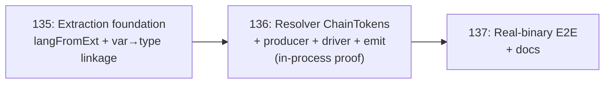

# Roadmap: v2.12 Production wiring for the type resolvers (C-family E2E)

## Milestone goal

Make the orphaned 12-language type-resolver dispatcher run in production so a
C-family type reference becomes a real, queryable `RESOLVES_TO` graph edge — proven
end-to-end through the `helix` CLI. See `v2.12-REQUIREMENTS.md` for full grounding,
the three intake traces (`agent://ProdEdgePath`, `agent://ResolverWireGap`,
`agent://VerbsAndE2E`), and the red-team (`agent://RedTeamV212`).

## Decision record — B2/B3 fork resolved: Option A (ChainTokens feed the resolver)

The red-team proved the milestone rests on a latent v2.11 contract break: resolvers
parse the type from the referencing symbol's `Signature`, but extractors strip it to
a bare name — so no type reaches the resolver. **Co-driver chose Option A:** the
reference producer links each var/field/param symbol to its co-located
`reference.type` and passes the type name via `ChainRequest.ChainTokens`; each
resolver's annotation tier consumes `ChainTokens` instead of re-parsing `Signature`.
This gives the 12-language dispatcher a REAL production consumer, keeps inference
tiers available, and fixes the real bug. Consequence: work spans the extractors, all
resolvers (`internal/semantic/types/*`), and the daemon wiring — the original "leaf
boundary" claim is relaxed accordingly.

## Phase sequence (risk-first: extraction → integration → real-binary proof)

The two extraction-side blockers (B1 trivial, B3 the real risk) are isolated in 135
and proven before any resolver/producer/integration work. 136 does the resolver
contract fix + the full integration spine, proven in-process against the REAL
extractor (not fabricated signatures — the trap that hid the bug for a milestone).
137 spends the E2E-harness cost only after the edge provably exists in a committed
snapshot.

---

### Phase 135: Extraction foundation — reach C-family files + link var→type

**Goal:** Make the production index actually extract C-family files, and establish
the (variable/field/parameter symbol → declared-type-name) linkage the reference
producer needs — the two extraction-side blockers, proven in isolation.

**Why first:** B1 + B3 are upstream of everything. If the C extractor never runs
(B1) or its output has no usable var→type link (B3), no resolver/producer/edge work
can succeed. Proving them first de-risks the milestone's foundation cheaply.

**Build:**
- **B1 — extend `langFromExt`** (`semantic_wiring.go:1812-1825`) to the C-family:
  `.c/.h→c`, `.cpp/.cc/.cxx/.hpp/.hh/.hxx→cpp`, `.cs→c_sharp`, `.java→java`. Update
  the doc comment. (Rust/Kotlin/PHP/Ruby deferred to v2.13 — extraction can be added
  then; adding only the C-family keeps the perf surface scoped and testable.)
- **B3 — var→type linkage.** In `factsFromExtracted` (which sees the raw
  `[]*extract.ExtractedFile` with `ef.References`/`ef.Symbols` and their ranges,
  `semantic_wiring.go:1934`), pair each variable/field/parameter symbol with its
  co-located `reference.type` (USES_TYPE) reference by range containment — yielding a
  `(referencing-symbol NodeID, declared-type-name)` tuple. Keep it a pure,
  deterministic helper (sorted, range-anchored) — NOT a signature change (avoids the
  StableKey churn of fork option B). If range-matching proves ambiguous for a
  language, the fallback is populating `ReferenceFact.ContainerID` in that extractor
  (bounded, per-language) — a plan-phase call.

**Success criteria:**
1. `index-semantic-graph` extraction reaches `.c/.h/.cpp/.cs/.java` files (B1):
   an in-process test over a real C fixture yields non-empty extracted symbols.
2. The linkage helper, run over the REAL C extractor's output for a
   `struct Foo {…}` + a `Foo`-typed declaration, produces the correct
   `(var NodeID, "Foo")` tuple (B3).
3. Anti-vacuity: a declaration with no resolvable type-reference yields no tuple
   (break-the-linkage guard asserts RED).
4. Determinism: the linkage helper is order-stable (sorted); repeated runs identical.
5. Zero new Go deps; `make vet` clean; affected-package `go test` green; no schema
   migration; existing extractor goldens unchanged (no signature/StableKey change).

**Exit gate:** The real C extractor runs in the production path, and its output
yields a correct, deterministic var→type tuple — proven in-process.

---

### Phase 136: Resolver ChainTokens consumption + producer + driver + emit

**Goal:** Fix the resolver contract (annotation tier consumes `ChainTokens`), build
the reference producer + driver + ChainResponse→EdgeFact converter, populate
`typeIndex` from `nameToNode`, and wire it into `factsFromExtracted` — so a committed
snapshot carries a real `RESOLVES_TO` edge with a non-zero DstNodeID. Prove it
in-process against the REAL extractor.

**Why second:** Requires Phase 135's var→type tuples as the producer's input.

**Build (the integration spine, Option A):**
- **B2 — resolvers consume ChainTokens.** Each resolver's annotation tier: if
  `req.ChainTokens` carries a non-empty type name, use it directly (the linked type
  from 135); else fall back to the existing `parseAnnotation(Signature)`. Touches all
  full resolvers (`go/typescript/python/java/csharp/c/cpp`); the 4 stubs
  (`rust/kotlin/php/ruby`) unchanged (v2.13). Preserves tier/evidence/confidence
  semantics + D-12.
- **Reference producer:** from the 135 tuples, build `[]types.ChainRequest`
  (RepoID, Language, FilePath via the `fileIDToPath` map at `:2351-2354`,
  RefNodeID = the referencing symbol node, RefKind=`RESOLVES_TO`, ChainTokens=[type]).
- **typeIndex from `nameToNode`:** inject each resolver's parsed-name→NodeID map from
  the existing `nameToNode` index (`:2355`), honoring the `nameCount>1` anti-mis-bind
  guard (`:2356-2368`). Needs a production injection path (exported setter or
  `NewResolverWithIndex`) — today `typeIndex` is test-mutated only.
- **Driver:** group refs per (package, language) iterating **sorted keys**, refs in a
  stable order (RefNodeID, then type name), run `FixpointResolve`, apply
  `cfg.MinConfidenceForEdge` (0.45) + `EmitUnresolvedEdges` (D1 determinism).
- **Converter + wire:** convert `[]ChainResponse` → `[]semanticstore.EdgeFact`
  (EdgeKind=`RESOLVES_TO`, SrcKind/DstKind, bounded Source per `emit.go:sourceFallback`,
  Weight=1.0, Confidence, ValidationState) and append to `out.Edges` before the dense
  EdgeID stamp. Runs at the end of `factsFromExtracted` (after `nameToNode` +
  `resolvePendingDst`, `:2374`). Consider gating dst=0 rows out pre-append (L4).

**Success criteria:**
1. In-process, REAL extractor → `factsFromExtracted` → `WriteSnapshotFacts` →
   `QuerySymbolEdgesOutgoing`: a C fixture with a resolvable type reference commits a
   `RESOLVES_TO` edge whose DstNodeID resolves to the correct type symbol's stable key
   (NOT a fabricated signature — real end-to-end in-process).
2. The 12-language dispatcher is invoked by `factsFromExtracted` (real consumer, SC2).
3. `nameCount>1` / out-of-repo ⇒ no target ⇒ edge gated/dropped, never fabricated.
4. Differential anti-vacuity (E1): the SAME suite asserts (i) the positive fixture
   yields exactly one RESOLVES_TO edge to the expected type AND (ii) a negative
   fixture yields zero; positive gates first.
5. Determinism: repeated in-process build → byte-identical `out.Edges` (sorted driver).
6. D-12 held; confidence gate applied; zero new deps; `make vet` clean;
   affected-package tests green; no schema migration.

**Exit gate:** A committed `RESOLVES_TO` edge with a real target exists for a C
fixture, produced by the production build path driving the real resolver, proven
in-process against the real extractor.

---

### Phase 137: Real-binary C-family E2E + acceptance + docs

**Goal:** Prove the wired spine end-to-end through the real `helix` CLI across the
C-family, and document the new production capability.

**Why third:** Requires 136 — the edge must exist in a committed snapshot before a
read verb surfaces it. Real-binary E2E is the milestone's headline deliverable.

**Build:**
- **E2E test** on the `internal/cli/cli_e2e_test.go` + `internal/eval/sandbox`
  harness (HELIX_BIN-gated, isolated `HELIX_SOCKET`, minimal env): per C-family
  language, seed a fixture with a resolvable type reference → `activate_project` →
  `helix switch-mode --target-mode=review` (index is review+, excluded from default
  `edit` mode) → `helix index-semantic-graph --mode=full` →
  `helix explain-symbol-deep --seed-json='{"file_path":"…","symbol_name":"…"}'` →
  assert an edge with `edge_kind=="has_type"` to the expected type symbol.
- **Differential anti-vacuity (real binary):** positive fixture yields the has_type
  edge; a no-type-ref fixture yields none.
- **Determinism guard:** repeated index → identical edge set.
- **Docs:** update `docs/type-resolution.md` — resolvers now production-wired for the
  edge (`has_type`) surface via ChainTokens; the richer `type_chain` surface remains
  pending the Schema-v6 migration. Fix the stale "7 languages" doc drift (dispatcher
  is 12) at `type_resolver_wiring.go:16-19` and `daemon.go:590-597`.

**Success criteria:**
1. A real `helix` binary driven as a subprocess returns a `has_type` edge from
   `explain-symbol-deep` for a C-family fixture after a full index — the production
   E2E the milestone is named for. At minimum C is proven; C++/C#/Java covered as
   fixtures allow (intra-package, per the v2.11 M1 scope limit).
2. Differential anti-vacuity + determinism guards green.
3. Mode-gate handled correctly (review+ for index).
4. `docs/type-resolution.md` updated; "7 languages" doc drift fixed.
5. Zero new Go deps; `make vet` clean; affected-package + E2E tests green.

**Exit gate:** A real-binary E2E proving C-family `RESOLVES_TO` resolution surfaces
via `helix explain-symbol-deep`, with differential anti-vacuity + determinism guards.

---

## Requirement coverage

| SC (from v2.12-REQUIREMENTS, post-fold) | Phase |
|---|---|
| B1 C-family extraction reachable | 135 |
| B3 var→type linkage (deterministic, anti-vacuous) | 135 |
| B2 resolvers consume ChainTokens | 136 |
| SC1 committed RESOLVES_TO edge w/ real target (in-process, real extractor) | 136 |
| SC2 dispatcher has production consumer | 136 |
| SC3 typeIndex from nameToNode + anti-mis-bind | 136 |
| D1 determinism (sorted driver) | 136 |
| SC4 real-binary has_type E2E | 137 |
| E1 differential anti-vacuity | 136 + 137 |
| SC6 determinism preserved (real binary) | 137 |
| SC7 D-12 + confidence gate | 136 |
| SC8 no deps / no migration / vet / tests / docs | 135 + 136 + 137 |

## Constraints

| Constraint | 135 | 136 | 137 |
|---|---|---|---|
| Zero new Go deps | ✓ | ✓ | ✓ |
| No schema migration | ✓ | ✓ | ✓ |
| Deterministic snapshot (byte-identical) | ✓ | ✓ | ✓ |
| Existing extractor goldens unchanged (no StableKey churn) | ✓ | ✓ | ✓ |
| D-12 always-emit | — | ✓ | ✓ |
| Leaf boundary | relaxed (Option A: extractors + types/* + daemon) | | |
