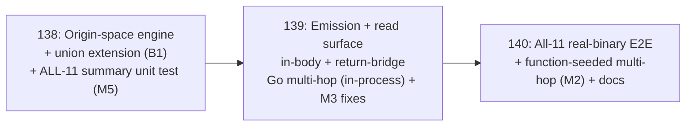

# Roadmap: v2.13 True intraprocedural DATA_FLOWS (in-body origins, variable-level)

## Milestone goal

Deepen the v2.9 case-1 DATA_FLOWS substrate so flow originating **mid-body** — the
return of an in-body call (`y := producer(); sink(y)`), not just a parameter — is
modeled and queryable across **all 11 languages**, using the **no-schema-change** cut:
edges anchor on existing **function** + **parameter** symbol nodes, never on persistent
variable-level nodes. See `v2.13-REQUIREMENTS.md` for full grounding + the red-team
fold (`agent://RedTeamV213`).

## Decision record — the co-driver's two locked scope calls (+ red-team fold)

- **Depth = in-body origins, no schema change.** Widen the flow-summary origin space
  (`{param idx}` → `{param idx ∪ callReturn(callee)}`); emit at existing symbol nodes
  with new `Source` markers (`def_use_inbody`, `def_use_return`). Preserves v2.9/v2.12
  invariants (zero deps, no migration, node = symbol identity).
- **Breadth = all 11 languages E2E — NOT free (red-team B1).** The flow engine's
  tree-sitter kind unions cover only 6/11 today (Go/TS/Java/C#/Rust/PHP). Python, Ruby,
  Kotlin, C, C++ need union extensions + Kotlin a structural split. This is folded into
  Phase 138 and verified there by a cheap all-11 unit test (M5), so breadth risk
  surfaces at the cheapest phase — not at the expensive Phase 140.

Load-bearing engineering decision (D-BRIDGE): the **dead** `ParamFlow.Returns` flag
(computed in `summary.go`, never consumed by `dataFlowEdges`) is reclaimed as the
`param → own-function` **return-bridge** edge — the minimal zero-schema connector that
makes in-body origins composable for multi-hop `producer → transform → sink`
reachability. Red-team CONFIRMED necessary + correct (BFS is node-ID adjacency,
kind-agnostic, visited-set terminates).

## Phase sequence (risk-first: engine+unions+all-11-unit → Go spine → real-binary breadth)

The precision risk (origin taxonomy, D-COMPOSE, determinism) AND the breadth risk (the
5-language union gap, B1) are BOTH isolated in Phase 138 and proven with cheap pure unit
tests — the red-team's single highest-value change (M5): breadth is verifiable before
any daemon/E2E cost. 139 builds the whole emission + read spine and proves it
end-to-end in-process on Go. 140 spends the expensive real-binary E2E harness cost to
CONFIRM (not discover) all-11 breadth + the function-seeded multi-hop payoff.

---

### Phase 138: Origin-space widening + kind-union extension + all-11 unit verification

**Goal:** The `dataflow` engine tracks in-body origins (call-returns), records
producer→consumer in-body flows + return-reachability, deterministically, and does so
across **all 11 grammars** (union extension + Kotlin split) — proven with pure unit
tests including a cheap all-11 matrix. No emission.

**Why first:** The origin taxonomy + D-COMPOSE semantics are the precision core; the
5-language union gap (B1) is the biggest risk to the headline. Both are cheapest to
prove here with pure tree-sitter unit tests, before any daemon/edge/E2E cost.

**Build (`internal/semantic/dataflow/summary.go`, leaf pkg):**
- **FLOW-04a** — `Origin` set over `{param(idx) | callReturn(calleeName)}`.
- **FLOW-04b (D-COMPOSE + m2)** — `processAssignment`: RHS unwraps (STRICT whitelist
  `{expression_list, parenthesized_expression}`) to a call ⇒ LHS = `callReturn(outermost)`;
  else identifier-origin propagation. Selector/member/index/binary/multi-call RHS ⇒ no
  in-body origin.
- **FLOW-04c** — `processCall` records `InBodyFlow{Producer, Consumer, ArgPos}` for
  `callReturn`-tainted args; v2.9 `CallArgTarget` path preserved.
- **FLOW-04d (D-BRIDGE)** — reclaim `Returns` as per-param reaches-return; record
  callReturn→return composition. No edge yet.
- **FLOW-04e** — carry new fields on `SymbolFact.FlowSummary` via `FingerprintBody` —
  all 11 providers inherit, no per-provider edit.
- **FLOW-04f** — determinism: dedup+sorted records; no map-iteration in the output path.
- **FLOW-04i (B1 union extension — the load-bearing fold):** add `assignment`
  (Python/Ruby) + `init_declarator` (C/C++) to `assignKinds`; `method_parameters` to
  `paramListKinds` (Ruby); `value_arguments` to `argListKinds` (Kotlin); a
  `property_declaration`-aware split for Kotlin (LHS `variable_declaration` + sibling
  `call_expression`).

**Success criteria:**
1. FLOW-04h fixtures pass on the real Go provider: single in-body, in-body+param
   coexisting, 2-hop chain — plus the m2 RED guards (nested-wrap positive;
   selector-RHS + multi-call-RHS negative).
2. Anti-vacuity (FLOW-04g): dead local ⇒ no in-body flow; pure-param body ⇒ no in-body
   flow. Revert-and-fail RED.
3. **All-11 unit matrix (M5):** `AnalyzeFlow` on `local := producer(); sink(local)` in
   **all 11 grammars** records the InBodyFlow — or a language is xfailed with a
   **recorded reason** (the honest breadth ledger starts here). Ruby's param list
   (`method_parameters`) now recognized (fixes the latent v2.9 zero-output).
4. Determinism: re-extract → byte-identical summary.
5. Zero new deps; leaf boundary intact; `make vet` clean; `go test
   ./internal/semantic/dataflow/... ./internal/semantic/extract/...` green.

**Exit gate:** The engine models in-body origins + return-reachability deterministically
for the fixtures AND the all-11 matrix is green (or has an explicit, recorded
per-language limitation) — breadth risk retired at the cheapest phase.

---

### Phase 139: In-body + return-bridge emission, read surface, Go multi-hop proof

**Goal:** Emit the two new edge kinds from Phase-138 summaries, prove they are a
distinct, honest, non-regressing edge set reachable from the CLI, prove multi-hop
reachability in-process on Go, and correct the now-false param-anchored invariants.

**Why second:** Requires Phase 138's `InBodyFlow` + return records + working unions.

**Build (`internal/daemon/semantic_similarity_edges.go` + `semantic_wiring.go`):**
- **FLOW-05a** — `inBodyDataFlowEdges`: resolve Producer→function node,
  Consumer→param node (`nameToNode`+`nodeToParams`, `nameCount==1`); emit per contract.
  **Wire STRICTLY AFTER `dataFlowEdges` (`semantic_wiring.go:2534`) — hard append-order
  constraint (M1).**
- **FLOW-05b (return-bridge, M4)** — emit `param → enclosing-function`
  (`Source:"def_use_return"`), **iterating the same sorted `withFlow` list**
  (`semantic_similarity_edges.go:484`), `nodeToParams` for LOOKUP only — never range the
  map. Directed-deduped. (No unbacked budget claim — m1.)
- **FLOW-05c (honesty)** — endpoint 0 ⇒ gated out; anti-mis-bind fixture.
- **FLOW-05e (non-regression, M1 reframed)** — the `def_use` param→param edge **SET**
  stays unchanged for the 6 already-working langs (explicit subset assertion — no
  EdgeID golden exists today, so a mis-wire would otherwise go uncaught). Ruby/Python/
  Kotlin newly emit v2.9 edges (disclosed folded fix). Snapshot determinism preserved
  (NOT a whole-snapshot byte-identity claim — impossible on mixed repos).
- **FLOW-05h (M3)** — correct the false doc-comments at `accessors.go:285-293` +
  `semantic_wiring.go:2810-2813`; rename/repurpose
  `TestDataFlowReachability_FunctionSeedEmpty`.

**Prove:**
- **FLOW-05d (distinctness)** — mutation-confirmed: in-body-only ⇒ in-body + zero v2.9;
  param-only ⇒ v2.9 + zero in-body; distinct from the similarity edges.
- **FLOW-05f (read surface)** — in-body + bridge edges appear in `explain-symbol-deep`;
  `trace_data_flow` BFS traverses function-anchored edges without error.
- **FLOW-05g (Go multi-hop, folded)** — in-process REAL Go: `src() → transform → sink`
  reachable via in-body → return-bridge → in-body; broken hop → reachability breaks.

**Success criteria:**
1. In-body + return-bridge edges emitted on a real Go fixture per the contracts.
2. Distinctness + honesty + non-regression (def_use SET) guards green, mutation RED.
3. Multi-hop reachability proven in-process (FLOW-05g), broken-hop guard.
4. New edges reachable via `explain-symbol-deep`; `trace_data_flow` non-erroring; M3
   invariants corrected.
5. Zero new deps; no schema migration; `make vet` clean; affected-package tests green;
   generated-file `--check` gates pass.

**Exit gate:** The full emission + read spine works, multi-hop reachability holds
in-process on Go, every guard RED-on-break, and the now-false invariants are corrected —
before the expensive real-binary breadth phase.

---

### Phase 140: All-11-language real-binary E2E + function-seeded multi-hop + docs

**Goal:** CONFIRM in-body-origin DATA_FLOWS end-to-end through the real `helix` CLI for
all 11 languages (Phase 138 already de-risked breadth), prove the function-seeded
multi-hop payoff through the binary for ≥1 language, document the capability + honest
limits.

**Why third:** Requires 139 — edges must exist in a committed snapshot before a read
verb surfaces them; the harness cost is spent only after the spine is proven.

**Build (`internal/cli` E2E harness, HELIX_BIN-gated, isolated HELIX_SOCKET, mode-gated):**
- **FLOW-06a** — per language: `local := producer(); sink(local)` fixture →
  `activate_project` → `switch-mode review` → `index-semantic-graph --mode=full` →
  `explain-symbol-deep` → assert a `data_flows` edge producer→consumer-param.
- **FLOW-06b** — any unresolved language is a tested, recorded limitation (carried from
  FLOW-04i); proven set stated in SUMMARY + audit.
- **FLOW-06c (M2)** — ≥1 language proves `producer → transform → sink` through the real
  binary by seeding `trace_data_flow` at the producer FUNCTION node (already accepted —
  no kind gate); broken-hop revert-and-fail. Stale seed docs fixed.
- **FLOW-06d** — repeated index → identical edge set (determinism).
- **FLOW-06e** — docs: in-body origins, the two `Source` markers, function-seed
  interaction, still-deferred surfaces.

**Success criteria:**
1. Real `helix` binary returns in-body `data_flows` edges via `explain-symbol-deep` for
   the proven set (target all 11; exceptions tested + documented).
2. Function-seeded multi-hop proven through the binary for ≥1 language (FLOW-06c).
3. Determinism guard green (FLOW-06d).
4. Docs updated; honest per-language proven/limitation ledger recorded.
5. Zero new deps; `make vet` clean; affected-package + E2E tests green.

**Exit gate:** A real-binary E2E confirming in-body-origin DATA_FLOWS surfaces via
`helix explain-symbol-deep` across the languages, with a function-seeded multi-hop proof,
determinism guard, and an honest per-language ledger.

---

## Requirement coverage

| Requirement | Phase |
|---|---|
| FLOW-04a–h origin-space widening + m2 guards | 138 |
| FLOW-04i union extension + all-11 unit matrix (B1/M5) | 138 |
| FLOW-05a in-body emission (append-order pinned, M1) | 139 |
| FLOW-05b return-bridge emission (M4 determinism) | 139 |
| FLOW-05c honesty / anti-mis-bind | 139 |
| FLOW-05d distinctness guard | 139 |
| FLOW-05e def_use SET non-regression + disclosure (M1) | 139 |
| FLOW-05f read surface | 139 |
| FLOW-05g Go multi-hop reachability | 139 |
| FLOW-05h M3 invariant/doc/test corrections | 139 |
| FLOW-06a all-11 real-binary E2E | 140 |
| FLOW-06b per-language honesty ledger | 140 |
| FLOW-06c function-seeded real-binary multi-hop (M2) | 140 |
| FLOW-06d determinism (real binary) | 140 |
| FLOW-06e docs | 140 |
| SC1–SC8 (success criteria) | 138 + 139 + 140 |

## Constraints

| Constraint | 138 | 139 | 140 |
|---|---|---|---|
| Zero new Go deps | ✓ | ✓ | ✓ |
| No schema migration | ✓ | ✓ | ✓ |
| Deterministic snapshot (fixed input) | ✓ | ✓ (M4) | ✓ |
| v2.9 def_use edge SET unchanged (6 langs) | — | ✓ (M1) | ✓ |
| Existing extractor goldens unchanged | ✓ | ✓ | ✓ |
| Leaf boundary (dataflow pkg) | ✓ | daemon+skill | cli E2E |
| New edge reachable from CLI | — | ✓ | ✓ |
| Breadth proven at cheapest phase (M5) | ✓ all-11 unit | Go-proven | all-11 E2E confirm |
