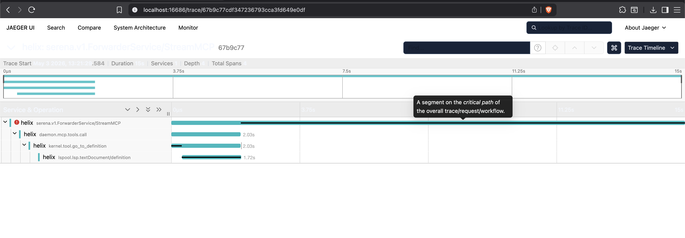

# Smoke-Test the Trace Pipeline

Verify the Helix trace pipeline produces the full span chain
(`forwarder.tools.call` -> `daemon.mcp.tools.call` -> `kernel.tool.{name}` -> `lspool.lsp.{method}`)
against a live OTLP/gRPC collector, with no orphan spans.

Run this procedure when:
- You add a new MCP tool and want to confirm its span path is wired correctly.
- You change tracing-related code in `internal/obs/`, `internal/kernel/spanwrap.go`,
  `internal/mcp/middleware.go`, or `internal/kernel/jsonrpc/conn.go`.
- You suspect a sampling or exporter regression.

## Prerequisites

- A container runtime — `podman` or `docker` (for the Jaeger all-in-one image;
  any OTLP/gRPC collector on `localhost:4317` works — Jaeger is the example
  because the all-in-one image is one command).
- A working `helix` binary (built via `make build` or downloaded from a release).
- A workspace with at least one supported language (Go, TypeScript, Python, etc.).

## Procedure

### 1. Start a local Jaeger collector

```bash
podman run --rm -p 4317:4317 -p 16686:16686 jaegertracing/all-in-one
```

(`docker run ...` works identically if you use Docker instead.)

Ports: `4317` = OTLP/gRPC ingest (Helix -> Jaeger); `16686` = Jaeger Query UI (browser).

### 2. Configure Helix to export traces

Create or update `~/.helix/helix_config.yml`:

```yaml
observability:
  tracing_endpoint: "localhost:4317"
  tracing_sample_ratio: 1.0    # sample EVERY trace for the smoke run
  service_name: "helix"
```

See `USAGE.md` ### Trace Sampling for production guidance (typical production
ratio is `0.01`, NOT `1.0`).

### 3. Start Helix and trigger a representative tool flow

Launch the daemon, then from any MCP client (Claude Code, Codex, etc.) invoke
a tool that exercises an LS call — for example `goto_definition` on any file.
`read_file` will NOT trigger an LS call and will not produce an `lspool.lsp.*`
span.

### 4. Open Jaeger and inspect the trace

Navigate to `http://localhost:16686/` -> Service: `helix` -> Find Traces.

## Expected Result

The most recent trace expands to show this span chain:

```
forwarder.tools.call          (root)
+-- daemon.mcp.tools.call     (TelemetryMiddleware; attrs: tool_name, profile, mode, language, outcome)
    +-- kernel.tool.goto_definition   (WrapToolSpan or AddSkillTool; zero attrs per D-07)
        +-- lspool.lsp.textDocument/definition   (Phase 55; attr: lsp.method)
```



Verify:
- **No orphan spans.** Every span has a parent except `forwarder.tools.call`.
- **`lsp.method` attribute present** on the `lspool.lsp.*` span.
- **Zero attributes on `kernel.tool.{name}`** (D-07 — TelemetryMiddleware owns attributes).
- **`ls.request` event** appears on the `kernel.tool.{name}` span (Phase 12 D-06
  frozen breadcrumb; see `.planning/phases/55-obs-trace-coverage-audit/TRACE-AUDIT.md`
  for the dual-representation rationale).

## Troubleshooting

| Symptom | Likely Cause | Fix |
|---------|--------------|-----|
| No traces in Jaeger UI | `tracing_endpoint` empty or wrong port | Confirm `localhost:4317` matches Docker port mapping. |
| Helix logs `OTLP exporter failure: ...` | Jaeger not running | Re-run the `podman run` (or `docker run`) command in Step 1. |
| Traces appear but `lspool.lsp.*` missing | LS path not exercised | Use a tool that hits the LS (`goto_definition`, `find_references`); `read_file` won't. |
| Only the root span appears | `tracing_sample_ratio = 0.0` | Set ratio to `1.0` for the smoke run. |
| `kernel.tool.{name}` span missing | Skill tool registered without WrapToolSpan/AddSkillTool wrap | Run `go test ./internal/obs/ -run TestEveryRegisteredToolWrappedWithKernelSpan` — the audit gate should have caught this. |

## Related

- `.planning/phases/55-obs-trace-coverage-audit/TRACE-AUDIT.md` — per-span attribute hygiene review.
- `internal/obs/trace_audit_test.go` — automated audit gate.
- `USAGE.md` ### Enable Tracing / ### Trace Sampling.

## Code references

- `internal/obs/tracing.go` — TracerProvider construction (Phase 12).
- `internal/mcp/middleware.go` — `daemon.mcp.tools.call` span emission (TelemetryMiddleware).
- `internal/kernel/spanwrap.go` — `kernel.tool.{name}` span emission (kernel-tool path).
- `internal/mcp/server.go` — `kernel.tool.{name}` span emission (skill-tool path; Phase 55).
- `internal/kernel/jsonrpc/conn.go` — `lspool.lsp.{method}` + `lspool.lsp.notify.{method}` (Phase 55).
- `internal/kernel/lspool/worker.go` — `ls.request` span event (Phase 12 D-06 frozen breadcrumb).
